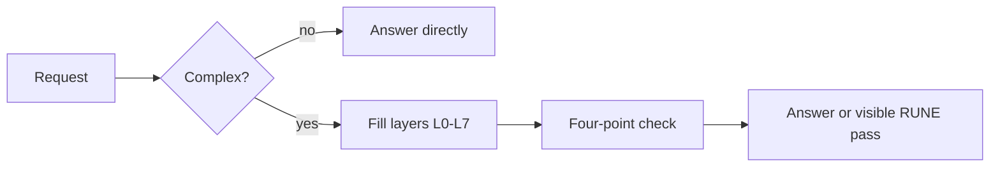

# RUNE skill for Hermes

A Hermes Agent skill that rewrites a rough request into an explicit 8-layer prompt, plus an optional shell wrapper around the RUNE `wand` CLI.

[](#license)
[](package.json)

**Measured result: in our blind pilot (50 pairs, 2 Gemini models) it did not make answers better.** Amplified prompts were preferred in 19.6% of decided pairs (95% CI 10.2–29.3%, 46 decided of 50), so they lost. The pilot covers only those prompts and models. Method, per-domain results and limits are in [RUNE docs/BENCHMARKS.md](https://github.com/neurabytelabs/rune/blob/main/docs/BENCHMARKS.md).

## Why

Agent instructions often leave role, scope, permissions, stop conditions and output format implicit. This skill gives Hermes a fixed checklist for making those parts explicit, which is useful when you want to read, review or reuse the structure of a request (subagent briefs, cron prompts, plans).

It is a structuring aid, not a quality booster. Given the pilot result above, do not expect better answers just because a prompt was amplified.

## Quick start

Install the skill into Hermes (only `SKILL.md` is needed):

```bash
git clone https://github.com/neurabytelabs/rune-skill
cd rune-skill
mkdir -p ~/.hermes/skills/prompt-engineering/rune-prompt-amplification
cp SKILL.md ~/.hermes/skills/prompt-engineering/rune-prompt-amplification/SKILL.md
```

Start a fresh Hermes session with the skill loaded:

```bash
hermes chat -s prompt-engineering/rune-prompt-amplification \
  -q "RUNE this into a launch plan: ship a private beta for my agent mesh"
```

New skills may only appear in a new Hermes session. Use the full categorized path to avoid name collisions with other RUNE-related skills.

### Optional: the `main.sh` wrapper

`main.sh` calls the RUNE `wand` CLI and strips ANSI colors so its output can be piped. It uses `wand` if it is on `PATH`, otherwise `$RUNE_DIR/wand.py` (default `RUNE_DIR` is `$HOME/Documents/GitHub/rune`).

```bash
git clone https://github.com/neurabytelabs/rune
cd rune && python3 -m pip install -e .    # requires Python >= 3.11
export RUNE_DIR="$PWD"
```

`rune-wand` is not published on PyPI at the time of writing, so install from source.

Commands that do not call a model:

```bash
bash main.sh version
bash main.sh grimoire
```

Commands that call a model need a provider (see Configuration):

```bash
echo "Explain quantum computing" | bash main.sh       # default: inscribe (show enhanced prompt only)
bash main.sh "Write a marketing email for my SaaS"
bash main.sh cast "Design a REST API for a todo app"  # enhance and run
bash main.sh validate "Check this prompt quality"
bash main.sh duel "Compare sorting algorithms"        # raw vs enhanced
bash main.sh swarm "Evolve the best coding prompt"
```

The wrapper accepts these `wand` subcommands: `cast inscribe duel grimoire test validate forge stats cost config fuse bind lineage swarm version`. Any other first argument is treated as prompt text for `inscribe`.

## Configuration

RUNE reads provider settings from environment variables and/or `~/.rune/config.toml`. Never commit real keys.

```bash
mkdir -p ~/.rune
cat > ~/.rune/config.toml <<'EOF'
[llm]
api_url = "https://your-openai-compatible-endpoint/v1/chat/completions"
api_key = "your-api-key"
default_model = "your-model"
timeout = 300
EOF
```

Or:

```bash
export RUNE_API_URL="https://your-openai-compatible-endpoint/v1/chat/completions"
export RUNE_API_KEY="your-api-key"
```

For backwards compatibility `main.sh` also sources `~/.secrets` if that file exists. New setups should use the options above.

## How it works



`SKILL.md` tells Hermes to answer simple requests directly and, for complex ones, to work through eight layers internally:

| Layer | Name | Covers |
|---|---|---|
| L0 | System Core | role, stance, behavioral rules |
| L1 | Context Identity | domain, history, audience, constraints |
| L2 | Intent Scope | goal, success criteria, output shape |
| L3 | Governance | safety, permissions, non-goals |
| L4 | Cognitive Engine | reasoning strategy, decomposition, critique |
| L5 | Capabilities | tools, files, integrations, retrieval |
| L6 | QA | final check (below) |
| L7 | Output Meta | language, tone, structure, format |

The L6 check asks four questions, named after Spinoza's terms: does the answer help the user act (Conatus), is it coherent (Ratio), is it clear (Laetitia), is it not overengineered (Natura). If one fails, the answer is revised.

Layers stay hidden unless the user asks for a visible "RUNE mode", in which case Hermes prints a compact L0–L7 breakdown. `SKILL.md` also contains short reusable patterns for planning, coding, debugging and cron-prompt design.

Repository contents:

- `SKILL.md` — the Hermes skill (frontmatter + instructions).
- `main.sh` — optional `wand` CLI wrapper.
- `package.json` — package and Hermes metadata.

## Status / limits

- The blind pilot found amplified prompts lost to raw prompts (see above). It covered one prompt set, Gemini generation models only, and a single sample per cell; it does not show how the skill behaves in Hermes on other models.
- `SKILL.md` is instruction text; there are no automated tests in this repo.
- `main.sh` depends on the separate [RUNE](https://github.com/neurabytelabs/rune) repo, which is not on PyPI.
- Declared platforms in `SKILL.md`: macOS and Linux.
- OpenClaw support is legacy: `main.sh` still works as an executable-style skill, but Hermes is the primary target.

To check changes to this repo:

```bash
bash -n main.sh
bash main.sh version
bash main.sh grimoire
```

## Related

- [RUNE framework](https://github.com/neurabytelabs/rune) — the `wand` CLI and the benchmark harness
- [RUNE Playground](https://github.com/neurabytelabs/rune-playground)
- [Hermes Agent docs](https://hermes-agent.nousresearch.com/docs/)

## License

MIT, as declared in `package.json` and the `SKILL.md` frontmatter. This repository does not yet contain a `LICENSE` file.

Author: [Mustafa Saraç](https://mustafasarac.com) · [NeuraByte Labs](https://neurabytelabs.com)
